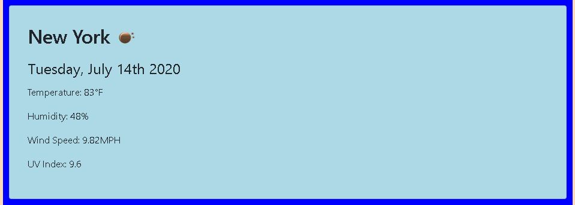

# weather-dashboard

## Project Title

This is the 6th Homework Assignment for the Columbia Coding Bootcamp. It is a Weather Dashboard. Be prepared for anything, rain or shine!

## Project Link

https://jamesrowe1.github.io/weather-dashboard

## Screenshot

## Getting Started

Type a city that you would like to know the current and future weather for. Once typed in, click the search button to see both the current weather and the forecast for the next 5 days. In addition, your history of choices is saved, and you can revist any of them at your leisure.

## Prerequisites

You must have a working web browser.

## Built With

- Visual Studio Code
- HTML
- CSS
- JavaScript
- jQuery
- Bootstrap
- Moment.js
- Chrome
- Hosted by Github
- Openweather API

## Authors

James Rowe

## License

Licensed under Awesome Coding L.L.C. (not a real company)

## Troubleshooting

For any issues contact James Rowe

## Acknowledgments

- Ben Wright
- Justin Simero
- And my study group:
- Gabriel Caplan
- Melissa Mercado
- Tanmay Sarker
- Tiffany Lombardi
- Umar Arshad
